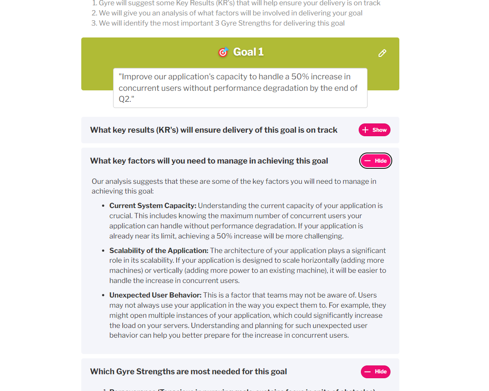

A psychologically backed team performance platform. I worked across the stack to build and maintain the web app. 

Some highlights from working at Gyre:

- Team Goals and OKRs feature. Team Leads are able to create goals for their team. We used AI to help reword the goal to help make it more specific and SMART. To do this we drew on resources from within the platform about how to write goals. Once a goal has been submitted the app produces a set of OKRs, an analysis of the key factors that will determine whether the team reaches this goal, and an analysis of which Gyre strengths are most needed for this goal.

- Migrated our class-component based Vue 2 app to a modern Vue 3 app.

- Implemented an in-app and email notification system, allowing the product team to create new CMS content with associated notifications without the need for further development.

- Created a system for our admins to setup new subscriptions with the relevant invite codes - turning 1 hour job into a couple of seconds.